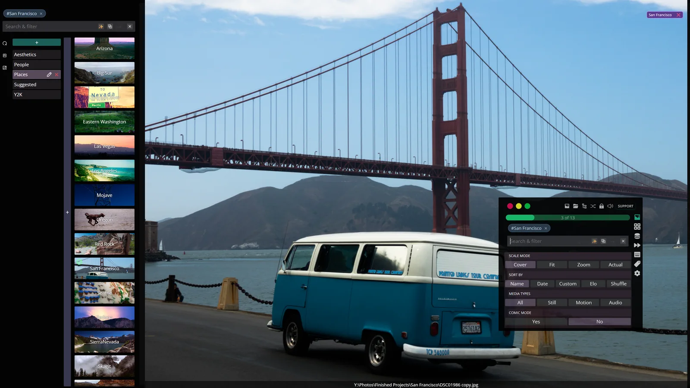
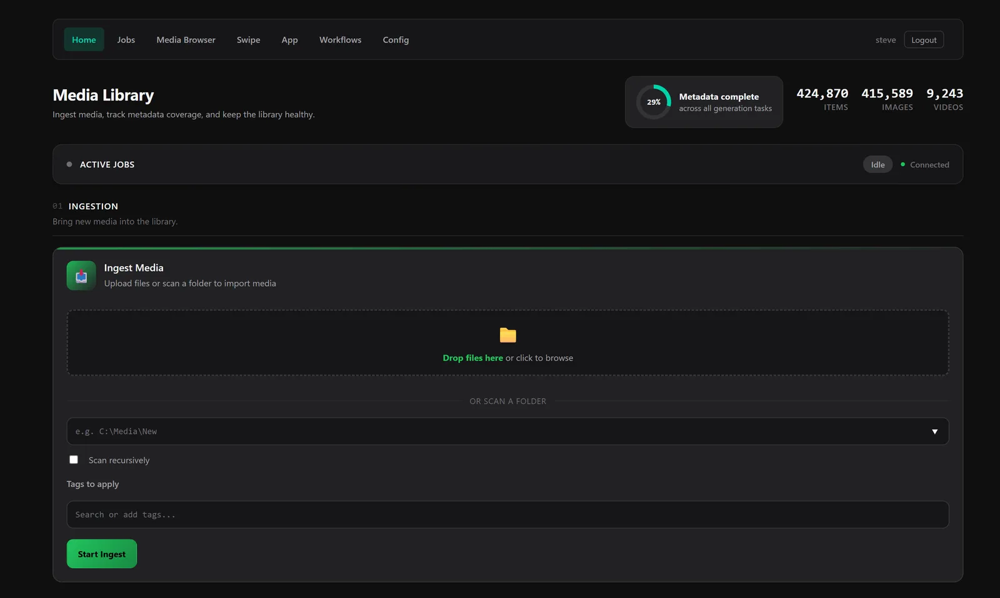
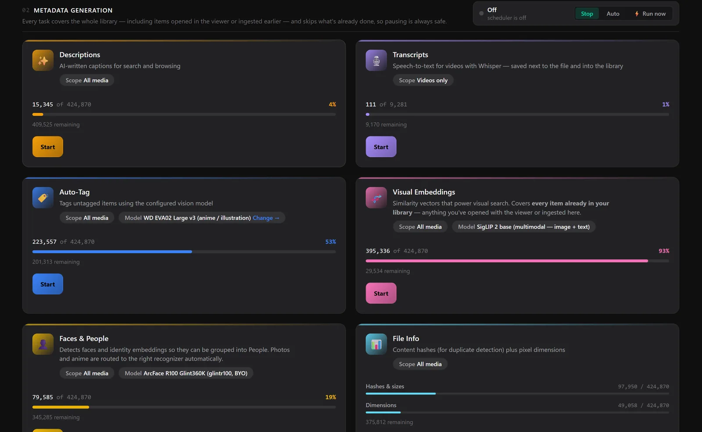
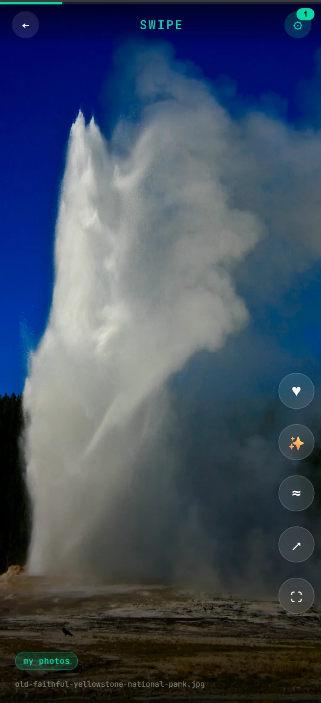
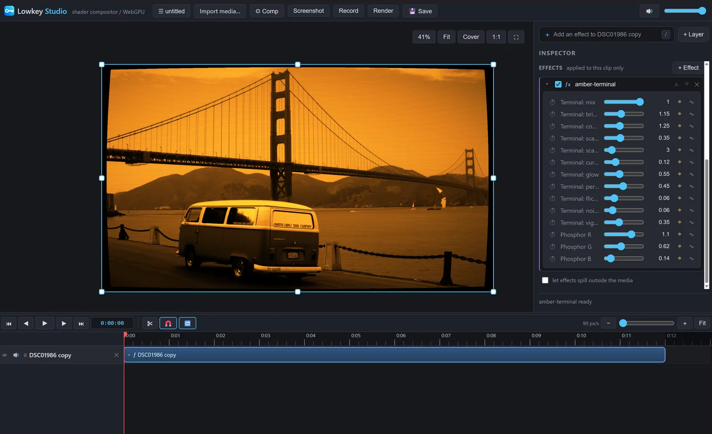

# Lowkey Media Viewer

**A fast, minimal viewer for the images, videos, audio, and comics already on your hard drive. Free and open source. Built for people who have a real media library and would rather look at it than fight their software.**

<video src="https://stevecastle.github.io/loki/static/viewer-overview.mp4" autoplay loop muted playsinline controls></video>

Most media apps want to take over your files: import them into a private library, re-encode them, ask you to sign in. This one doesn't. Point it at a directory and it opens. Your files stay where they are, in the formats you already have, and tags go into a local SQLite database you can copy and back up like any other file. There's no account and nothing phones home.

It's aimed at the kind of library other tools choke on: millions of images and videos piled up over years, mixed formats, comic archives, audio, screenshots, weird old `.webm`s. If you want to view that stuff, tag it, find it again later, and not lose it when some service shuts down, this is for you.

**Download free** at [**lowkeyviewer.com**](https://lowkeyviewer.com) for **Windows, macOS, and Linux**.

The repo also holds two companion projects: **Lowkey Media Server** (batch processing, AI auto-tagging, transcription, a web UI) and **Lowkey Studio** (a WebGPU keyframe compositor for editing the media you're looking at). Both are covered below.

---

## Why use it

- **Fast.** Opens enormous folders without hanging. Renders 4K videos and high-res images without stutter. Developed against a working library of **2 million+ media items and 5 million+ tag assignments**.
- **Local-first.** Your media stays where you put it. Tags live in a SQLite database in your home directory that you own and can back up. Nothing syncs anywhere, and there's no account.
- **Free and open source.** MIT licensed, no paywalled features. There's a [Patreon](https://www.patreon.com/c/lowkeyviewer) if you want to support the project, but nothing is behind it.
- **Stays out of the way.** Dark UI, no chrome you don't need, full-screen modes, hotkeys for everything.
- **Handles awkward stuff.** Comic archives (`.cbz`, `.cbr`) open like directories. Video subtitles get picked up automatically. Audio gets a WebGPU visualizer. Transcripts are editable in place.
- **Cross-platform.** Native installer for Windows, signed and notarized DMG for macOS (Apple Silicon + Intel), AppImage for Linux.



*Tag categories down the left, tags with their own cover previews next to them, and the floating command palette over the image. The palette is the same search-and-filter box the sidebar uses, plus scale mode, sort order, and the media-type and comic-mode switches. Almost everything is one keystroke or one drag away rather than buried in a menu.*

---

## Features

### Viewing

- **Images**: JPG, JPEG, PNG, GIF, WebP, JFIF, BMP, SVG, and animated GIF
- **Video**: MP4, MOV, MKV, WebM, FLV, M4V, with subtitle pickup (SRT/VTT) and audio-track selection on multi-track files
- **Audio**: MP3, M4A, AAC, OGG, WAV, with a WebGPU spectrum visualizer
- **Comic archives**: `.cbz` and `.cbr` (CBR uses a bundled UnRAR binary, so it Just Works on every platform)
- **Detail, grid, and masonry layouts** with multiple scale modes, shuffle, and infinite scroll
- **Background autoplay** with looping, fit modes, and configurable transitions

### Organizing

- **Tags and categories**: drag any tag onto any image to apply it. Bulk-apply to a whole filter, or hold Ctrl to apply to every visible item.
- **Custom tag previews**: use any image you're viewing as the cover for a tag
- **Stored category slots** (1–9) so your most-used categories are one keystroke away
- **Command palette** for fast tag, category, and file actions
- **Context palette** (Shift + right-click) for in-place edits
- **Battle mode**: pairwise comparison with ELO ranking, then apply the resulting order as a custom sort
- **Duplicate detection** with perceptual hashing
- **Reorder tags and media** by drag-and-drop within a category

### Finding things

- **Tag filtering** with OR / AND / Exclusive modes
- **Fuzzy tag search** across every tag in every category
- **Filename search** as you type
- **Description search**, if you've generated descriptions via the server
- **Transcript-driven video navigation**: click a line of a transcript to jump to that moment
- **Visual similarity and face search**: "more like this", text-to-image, and per-person filtering, if you're running the server

### Editing

- **Open in Studio**: right-click any image or video and hand it to [Lowkey Studio](#lowkey-studio), the built-in WebGPU compositor. Save the result straight back over the file.

### Metadata & transcripts

- **Tag and category descriptions**: markdown notes that travel with your tags
- **In-place transcript editing**: Enter to save, Shift+Enter for a newline, per-cue delete, insert button
- **In-panel substring search** through transcripts with prev/next navigation
- **Captions and subtitles** picked up from SRT/VTT sidecars next to video files, auto-converted to WebVTT with BOM/CRLF normalization

### Built for big libraries

"Big" here is a specific number. The reference library this gets developed against holds **over 2 million media items, more than 5 million tag assignments, and hundreds of thousands of vector embeddings**. That's what the query engine, the virtualized lists, and the job queue are tuned for. Most of the list below exists because the naive version fell over at that size first.

- Virtualized scrolling, so a 190,000-row tag list or a million-item grid scrolls without stutter
- Queries compile to SQL and run against indexed tables; counts and stats are snapshot-cached rather than computed inline
- Thumbnails generated on demand and cached
- Selection state, query state, and library state persisted across launches
- File-association registration on Windows and macOS so you can set it as your default viewer

---

## Three products, one repo

```
Lowkey Media Viewer   look at your library, tag it, find things     Electron + React
Lowkey Media Server   do the slow work: transcode, tag, transcribe  Go + SQLite
Lowkey Studio         edit what you're looking at                   WebGPU, browser-native
```

They ship together because they're one workflow (browse, act on what you found, then change it) and because the viewer and the server literally share a frontend. `src/renderer/` is a single React app that runs both as the Electron renderer process and as the web UI the Go server embeds. `src/renderer/platform.ts` sits in the middle and routes each call to either Electron IPC or HTTP.

A few things hold across all three:

- **Your files stay yours, where you put them.** Nothing gets imported into an opaque library, re-encoded on ingest, or renamed. The database is a SQLite file that indexes paths. Delete it and your media is untouched.
- **Local-first, no account.** No sync service, no telemetry, no login wall. The server has auth because you might expose it on a network, not because anyone wants an identity for you.
- **Nothing is required.** The viewer works alone. Adding the server gets you jobs and AI features, adding Studio gets you editing, and taking either away leaves the layers below it working. Studio runs as a static web page with no backend at all.
- **Slow work happens in the background.** Tagging, transcription, transcode, embedding: all of it is a job with progress you can walk away from, never a frozen UI.
- **Built for the actual scale.** See the numbers above. Features that only work on a 5,000-file demo library don't ship.
- **Free and MIT.** No paid tier in any of the three.

---

## Get it

Prebuilt binaries are at [**lowkeyviewer.com**](https://lowkeyviewer.com). Builds are signed and notarized on macOS, NSIS-installed on Windows, AppImage on Linux. New releases ship straight from `master`. The desktop app bundles Studio; the server is a separate download.

Studio alone needs nothing installed. Open [**lowkeyviewer.com/studio**](https://lowkeyviewer.com/studio/) in any browser with WebGPU.

If you'd rather build from source, see [Building from source](#building-from-source) below.

---

## Lowkey Media Server (optional companion)

Reach for the server when you don't want the desktop app tied up in a long-running task: auto-tagging 10,000 photos with an AI model, transcribing a 4-hour video, transcoding a library to adaptive HLS, ingesting a YouTube channel. Run it on the same machine as the viewer, or on a NAS or home server.



*The home page is the library dashboard: item counts, metadata coverage across every generation task, live job status, and ingestion by drag-drop or folder scan. Those counts are snapshot-cached, so nothing here is tallying 400,000 rows while you wait.*

What you get:

- **A job queue** with real-time progress over SSE. Start things, walk away, come back later.
- **Visual workflow editor** for chaining tasks into reusable pipelines (transcode → screenshot → auto-tag → ingest)
- **Auto-tagging** using ONNX models (WD-EVA02-Large-Tagger v3) or Ollama vision models
- **Visual similarity search**: SigLIP2 embeddings with an exact parallel cosine scan, so "more like this" and text-to-image queries stay accurate at hundreds of thousands of vectors instead of degrading the way an approximate index does
- **Face grouping**: detect, embed, and cluster faces into people, across both photographic and illustrated/anime domains, routed automatically per item
- **Transcription** of any video via Faster-Whisper
- **Ingestion** from local folders, YouTube (yt-dlp), galleries (gallery-dl), and Discord exports
- **HLS adaptive streaming** so the viewer can scrub through massive videos remotely
- **FFmpeg toolkit** with 16 presets (scale, convert, extract audio, screenshots, thumbnail sheets, and so on) plus raw passthrough
- **S3-compatible storage** alongside local disks
- **A web UI** for everything above. It works in any browser and embeds the same React app the desktop viewer uses.
- **Browser extensions** for Chrome and Firefox: right-click a page and send it to your queue



*Each metadata task shows coverage over the whole library and picks up where it left off. Every task skips what's already done, so pausing is safe and resuming is just pressing Start again.*

There's also a **Swipe** mode: a phone-friendly view for triaging a library from the couch. Swipe to like, hop to visually similar items, or open the current one in the full browser.



Authentication is on by default (JWT + bcrypt). First launch creates a temporary `admin` / `admin` user and walks you through a setup wizard to replace it.

The viewer detects the server automatically once both are running, and the bulk-job actions turn on.

**Get it the same way:** prebuilt binaries on [lowkeyviewer.com/server](https://lowkeyviewer.com/server), or in Docker. All three products ship from the same release, so the server carries the same version number as the viewer. Full setup, configuration, environment variables, task catalog, and API reference live in [`media-server/README.md`](media-server/README.md).

---

## Lowkey Studio

**A keyframe compositor that runs entirely on WebGPU, in a browser tab, with nothing uploaded anywhere.** It's there for the "this clip is almost right" moment, which is usually where a viewer hands you off to a 90 GB install and a subscription.

Try it right now, no download, at [**lowkeyviewer.com/studio**](https://lowkeyviewer.com/studio/) (Chrome/Edge 113+, or any browser with WebGPU). Drop a video on it and it becomes a clip.

Inside the desktop app it's the same code with a shorter path: right-click any image or video → **Open in Studio**. The file is imported straight into a comp, and when you're done, **Save** writes the render back over the original (transcoded to match its container by the bundled ffmpeg, with the original held as a backup until the swap succeeds). Images save as a video alongside the source instead of overwriting it. The viewer picks up the change and refreshes in place.



*The same photo from the top of this page, handed to Studio and run through an amber-terminal CRT shader. Every parameter on the right has a ⏱ to keyframe it and a ∿ to drive it from an oscillator or the audio track, and **Save** puts the result back where the file came from.*

### What it does

- **Timeline and layers**: tracks top to bottom like After Effects, drag/trim/split clips, zoomable timeline, timecode scrubbing
- **Keyframes on everything**: position, scale, rotation, opacity, and every parameter of every effect, with per-segment easing. Keyframe times are clip-relative, so moving a clip carries its animation with it.
- **Effect stacks on any layer**: every clip owns an ordered stack of shaders. On a media clip the stack processes that clip alone before it composites; on an fx clip it processes everything below it, i.e. an adjustment layer. Same data model, two scopes.
- **78 bundled effects** across 12 categories: adjust, blur & bloom, stylize, colour split, dithering, CRT & retro displays, motion-reactive, tempo-synced, glitch & analog, overlay, atmosphere, glass
- **A live shader editor**: write GLSL/Slang against the current frame and watch it compile in the browser (glslang → SPIR-V → WGSL, both toolchains shipped as wasm). Your shader becomes a normal effect with keyframable parameters.
- **Masks**: paint by hand, chroma-key a colour out, or use another layer's alpha/luma as a matte, stacked as nodes on any clip. A clip's mask gates its whole effect stack as one group, so masking six effects is one operation. Expand and feather run as GPU post-passes.
- **Shape and title layers**: draw shapes right onto the preview or drop in text. A shape layer holds a list of shapes and its box shrink-wraps to them without anything shifting on screen.
- **Property drivers**: modulate any property procedurally instead of by hand, with an oscillator (sine/triangle/saw/square/pulse/bounce/noise, frame-lockable) or an **audio-reactive envelope** from the comp's own mix, per frequency band, following level or firing on detected beats. Envelopes are precomputed offline so scrubbing, playback, and export all see identical values.
- **Two ways out**: **Record** captures the comp to WebM in real time with the live audio mix. **Render** runs it offline through WebCodecs as fast as the GPU allows (roughly 4× realtime), frame-exact with no dropped frames. **Screenshot** exports the current frame as a PNG.
- **Projects persist locally**: comps autosave to IndexedDB with named saves and recents. Media never leaves your machine, and Studio has no server side at all.

### How it fits

Studio is a plain static ES-module web app: no bundler, no framework, no backend. That's what lets the same files be a page on the docs site, a tab you can bookmark, and a window inside Electron. In the desktop app it's served over a privileged `studio://app` custom scheme rather than `file://`, because ES modules, `fetch`, and WebGPU all need a real secure origin. Local media reaches it as same-origin routes on that scheme, so there's no CORS and no Node access in the window.

The rendering engine, shader compiler glue, and presets under `studio/engine/`, `studio/vendor/`, and `studio/shaders/` are vendored from the separate **slangfx** project. `studio/` is the source of truth in this repo, and `node studio/publish.mjs` syncs it to `docs/studio/` for GitHub Pages.

More detail in [`studio/README.md`](studio/README.md).

---

## Building from source

The viewer is an Electron + React + TypeScript app. The server is a single Go binary. Studio is a dependency-free static web app. They live in the same repo because the viewer and server share a React renderer, and the viewer ships Studio inside its own package.

### Prerequisites

- **Node 18** (CI builds against `18.x`)
- **npm**. `package.json` declares `"packageManager": "npm@10.9.0"`. Yarn is no longer supported, and there's no `yarn.lock`.
- **Go 1.24+**, only for the server
- A C compiler is **not** required for either product. SQLite uses pure-Go drivers everywhere.

### Build & run the viewer

```bash
npm install
npm start        # webpack-dev-server + electronmon
npm test         # builds first, then runs jest
npm run package  # build a distributable for the current OS
```

`npm run package` produces an NSIS installer on Windows, a universal DMG on macOS, and an AppImage on Linux. Artifacts land in `release/build/`. FFmpeg/FFprobe binaries are auto-downloaded as part of packaging.

### Build & run the server

```bash
npm run build:server   # builds the React UI, embeds it, then go build
cd media-server
./media-server          # or media-server.exe on Windows
```

Then open <http://localhost:10111> and log in as `admin` / `admin`.

For faster iteration:

```bash
npm run build:web       # build the renderer and copy into media-server/loki-static/
cd media-server
go run .
```

Re-run `build:web` after renderer changes or the Go binary will keep serving the old assets. The static files are embedded at compile time.

### Build & run Studio

There's no build step. It's ES modules served as-is.

```bash
npm run studio:serve     # http://localhost:8790/studio/  (serves the docs tree)
npm run studio:publish   # copy studio/ → docs/studio/ for GitHub Pages
```

Edit files under `studio/` and reload the page. Run `studio:publish` before committing so the published copy under `docs/studio/` stays in sync, and commit both. `npm run package` picks up `studio/` automatically via `extraResources`, which is how the Electron build gets its copy.

### Tests

```bash
npm test               # viewer (Jest)
npm run test:server    # server (go test ./...)
```

---

## Repo layout

```
loki/
├── src/                # Electron app
│   ├── main/           # Main process (Node): IPC, archives, thumbnails, transcripts,
│   │                   #   studio-window.ts (studio:// scheme + edit-and-save-back)
│   └── renderer/       # React + XState SPA (also embedded by the media server)
├── media-server/       # Go module: HTTP API, auth, job queue, HLS, S3 storage, web UI
│   ├── auth/           # JWT + bcrypt user auth
│   ├── tasks/          # Self-registering task implementations
│   ├── jobqueue/       # SQLite-backed job + workflow DAG engine
│   ├── storage/        # Local + S3-compatible storage registry
│   ├── runners/        # Worker pool that dispatches jobs to task fns
│   ├── embedindex/     # Exact parallel cosine scan over SigLIP2 vectors
│   ├── onnxface/       # Face detection, embedding, and clustering
│   ├── deps/           # On-demand download manager (ffmpeg, yt-dlp, gallery-dl, whisper, onnx)
│   ├── renderer/       # Go HTML templates for the admin web UI
│   └── loki-static/    # Built React renderer embedded at compile time
├── studio/             # Lowkey Studio: static WebGPU compositor (source of truth)
│   ├── engine/         # slangfx-web runtime: multi-pass WebGPU engine + toolchain glue
│   ├── vendor/         # glslang.wasm (GLSL→SPIR-V) + twgsl.wasm (SPIR-V→WGSL)
│   ├── shaders/        # The 78 bundled .slangp effect presets
│   └── publish.mjs     # Sync studio/ → docs/studio/
└── docs/               # Source for lowkeyviewer.com (includes the published studio/)
```

`src/renderer/platform.ts` is the abstraction layer that lets the same React code run as the Electron renderer process or as the web UI served by the Go server. Studio shares no code with either. It's deliberately dependency-free so it can be dropped onto any static host, and it talks to the desktop app only through the launch and save routes on the `studio://` origin.

## Releases

`.github/workflows/release.yml` runs on every push to `master`:

1. Runs the Electron Jest tests and Go tests.
2. Tags the commit `vX.Y.Z` from `package.json` if the tag doesn't already exist.
3. Builds the Electron app for Windows, macOS (arm64 + x64), and Linux in parallel.
4. Cross-compiles the Go server for `windows/amd64`, `darwin/{arm64,amd64}`, and `linux/amd64`.
5. Generates a changelog from commits and contributors since the previous tag.
6. Publishes everything to GitHub Releases.

To cut a release: bump the version in `package.json`, `package-lock.json`, `release/app/package.json`, `release/app/package-lock.json`, `docs/index.html`, and `docs/server/index.html`, then push to `master`.

## Contributing

Fork, branch, and open a pull request against `master`. If you've forked the project and built something interesting on top, I'd love to hear about it.

## License

MIT. See [LICENSE](LICENSE).
