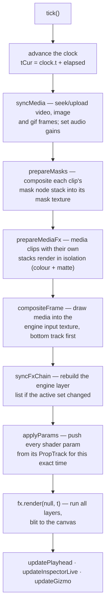
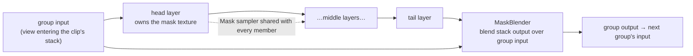

# Lowkey Studio — how it works

A technical tour of `studio/`: what each module owns, what happens in a
frame, and why the parts that look strange are shaped the way they are.

Studio is a keyframe compositor that runs entirely in the browser on
WebGPU. There is no server and no upload: media stays in the tab, shaders
compile in the tab, and the exported file is muxed in the tab. It ships two
ways — as the *Studio* tab of the docs site (`docs/studio/`, published from
this directory), and embedded in the Lowkey viewer, which opens it with
`?app=1` and hands it media to edit.

---

## 1. The one-paragraph model

**The comp is plain JSON. The frame is re-derived from it every tick.**
Nothing is baked, cached to disk, or accumulated across edits — no undo
buffer of pixels, no flattened layers. A clip's position, a shader's
`radius`, a mask's opacity are all just numbers in a JSON tree, and every
frame walks that tree and rebuilds the picture on the GPU. That is why
undo is a structural snapshot, why scrubbing backwards is exact, and why
the offline exporter can produce byte-identical output to the preview: both
call the same functions with the same time value.

The only two exceptions — the two places state survives a frame — are GPU
feedback buffers (a shader reading its own last output) and video decoder
position. Both are called out where they appear.

---

## 2. Module map

| File | Lines | Owns |
| --- | --- | --- |
| `comp.js` | 551 | The data model: tracks, clips, property tracks, keyframes, easing, undo history. UI-free, `JSON.stringify`-able. |
| `app.js` | 7.7k | Everything wiring the model to the GPU and the DOM: playback clock, media sync, chain management, inspector, masks, import/export, persistence. |
| `compositor.js` | 288 | Draws media clips into the frame with their 2D transform and blend mode. |
| `timeline.js` | 1.6k | The zoomable timeline: tracks, clips, keyframe lanes, all direct manipulation of the model. |
| `driver.js` | 123 | Property drivers — oscillators and audio-reactive modulation. Pure functions. |
| `audio-analysis.js` | 207 | Offline band-envelope + beat analysis feeding audio drivers. |
| `audio-fx.js` | 427 | The Web Audio effect catalogue (reverb, EQ, filters, …). |
| `audio-widgets.js` | 323 | Draggable response-curve widgets for audio effects. |
| `shader-editor.js` | 155 | Zero-dependency slang code editor (textarea over a highlighted `<pre>`). |
| `roto.js` | 250 | AI rotoscoping model layer: SAM-family encoder/decoder via onnxruntime-web, loaded from CDN on demand and cached. Stateless per call; the temporal story lives in app.js. |
| `engine/` | 2.4k | **slangfx-web** — the WebGPU multi-pass shader engine. Vendored from the [slangfx](https://github.com/SteveCastle/slangfx) repo. |
| `shaders/` | — | The bundled `.slangp` presets, one directory per effect. Also vendored. |
| `effects.json` | — | The manifest the add-effect picker reads: categories + preset paths. |

`engine/` and `shaders/` are snapshots of the upstream slangfx repo. Fixes
that belong to the engine or to a shipped preset should land there and be
re-copied; everything else is native to this directory.

---

## 3. The data model

### Comp → tracks → clips

```js
comp = {
  width, height, fps, dur,
  tracks: [ { name, hidden, muted, clips: [ … ] }, … ],   // top-to-bottom
}
```

Tracks are ordered like After Effects: **index 0 is the top track**.
Rendering walks bottom-up, so a higher track composites over a lower one
and an adjustment layer on a higher track applies later in the chain.

There are three clip kinds:

| kind | has picture | has sound | what its effect stack processes |
| --- | --- | --- | --- |
| `media` | ✔ (video / image / gif) | if the file has audio | **that clip alone**, before it composites |
| `audio` | ✘ | ✔ | that clip's sound only |
| `fx` | ✘ (adjustment layer) | ✘ | **everything composited below it** |

Every kind carries one ordered `clip.effects` array. An entry is either a
*visual* effect (a shader preset path, or hand-written slang) or an *audio*
effect (`fxKind: 'audio'`, named by `audioId`). They share one list, one id
namespace and one UI, but they are two independent chains — `visualEffectsOf`
and `audioEffectsOf` split them, and nothing ever mixes them.

A **shape layer** is a media clip with `clip.shapes` and a synthetic
`shape:<clipId>` asset: a 1024² canvas regenerated from the model on load,
never stored in IndexedDB.

### Property tracks

Every animatable number is a `PropTrack`:

```js
{ v: 100, anim: false, keys: [ { t, v, e }, … ], driver?: { … } }
```

* `t` is **clip-relative seconds** — moving a clip carries its animation
  with it, which is the whole reason it isn't comp time.
* `e` names the easing applied *leaving* that key (`linear`, `inout`,
  `back`, `elastic`, `bounce`, `hold`, …).
* `evalProp` binary-searches the keys and interpolates; a static prop just
  returns `v`.

Transform props live at `clip.props.{x,y,scaleX,scaleY,rot,opacity,volume}`.
Shader parameters live at `effect.params[name]` and are addressed from the
UI by a composite key, `` `${effectId}:${name}` `` (`effectPropKey` /
`parsePropKey`) — that's what lets one flat property list drive both the
inspector rows and the timeline lanes.

### Time, rate, and trims

```js
clipRate(clip)          // playback speed: source seconds per comp second
srcTime(clip, t)        // clip.in + (t - clip.start) * rate
```

`srcTime` is the **one** trim×speed mapping. Every path that touches source
media — preview sync, export seeking, splitting, trimming, waveforms —
goes through it. Retiming a clip (`retimeClip`) rescales keyframe times so
animation stretches with the clip.

### Undo

`History` (in `comp.js`) keeps **deep JSON snapshots of the whole comp**.
`history.record(comp, fn)` snapshots, runs the mutation, and pushes; drags
use `history.begin` / `history.commit` so one gesture is one step. Undo
replaces the comp object wholesale, which is why `afterModelReplace()` has
to resync everything derived from it (custom shader sources, shape assets,
GPU chains).

---

## 4. A frame

`tick()` runs on `requestAnimationFrame` and does this, in this order:



Order matters at three points, and each is a rule worth keeping:

1. **Masks before compositing.** A media clip's mask multiplies its alpha as
   it composites, so the mask texture must already exist when
   `compositeFrame` samples it.
2. **Isolated media effects before compositing.** A media clip that carries
   its own stack doesn't composite its raw frame — it composites the
   *output* of its private chain, so that has to run first.
3. **`syncFxChain` before `applyParams`.** Params are written into live
   runtimes; a runtime that hasn't been built yet has nowhere to put them.

### Where the picture actually comes from

`compositeFrame` splits the active media draws into two buckets:

* **`base`** — everything below the lowest working adjustment layer. These
  draw straight into `fx.inputView`, the engine's input texture.
* **`fxOverlays`** — media that sits *above* an adjustment layer in the
  track stack. That media must not be processed by the effect below it, so
  it can't go into the input texture.

The overlay bucket is composited later, through an engine hook:

```js
fx.onAfterLayer = (encoder, layer) => {
  if (layer.maskGroup && layer.maskGroup.tail !== layer) return;  // once per clip
  const draws = fxOverlays.get(layer.clipId);
  if (!draws?.length) return;
  const view = layer.blendView ?? layer.runtime.finalPass.fboView;
  compositor.composite(encoder, view, comp.width, comp.height, draws, { over: true });
};
```

So the layer stack and the track stack stay consistent: an effect only ever
sees what is genuinely below it.

One more subtlety in `compositeFrame`: an fx clip only counts as a barrier
if `clipHasLiveLayers(clip.id)` — an adjustment layer whose shader is still
compiling, or failed, is transparent to this logic, so media above it
merges down instead of hanging in limbo.

---

## 5. The engine (`engine/`)

`SlangFx` owns one GPU device, one input texture, and an ordered list of
**layers**. A layer is one effect: a `.slangp` preset expanded into a
`PresetRuntime` with a framebuffer per pass.

### Compiling a shader

Presets are libretro-format `.slangp` files; the shaders are GLSL 450 with
libretro's slang conventions. The browser path is:

```
.slang source
  → flattenIncludes()          resolve #include
  → preprocessSlang()          the WebGPU rewrites (below)
  → glslang.wasm               GLSL 450 → SPIR-V
  → reflectSpirv()             our own SPIR-V walk → uniform offsets, bindings
  → twgsl.wasm (tint)          SPIR-V → WGSL
  → GPURenderPipeline
```

Reflection is ours rather than tint's because the per-frame uniform writes
need authoritative *byte offsets* for every member of the push-constant
block.

`preprocessSlang` performs three rewrites WebGPU requires:

| Rewrite | Why |
| --- | --- |
| `layout(push_constant) uniform Push {…}` → `layout(std140, set=1, binding=0)` | WebGPU has no push constants. A dedicated bind group avoids colliding with the shader's own resources. |
| `uniform sampler2D X` → `texture2D X_tex` + `sampler X_smp` (samplers in bind group 2, declaration order) | tint's SPIR-V reader rejects combined image-samplers. A `#define` keeps every use site compiling unchanged. |
| `//@param name "Label" default min max step` → a `#pragma parameter`, a `float` member in the push block, and a `#define` | One-line tunables for hand-written shaders. |

Two failure modes are handled specially. glslang reports its useful
line-numbered diagnostics through `console.error`, not the thrown
exception, so the compiler captures them for the editor UI. And when
Chrome's uniformity analysis rejects a `texture()` call in non-uniform
control flow, `rebuild()` retries the whole layer with
`#define texture(s,uv) textureLod(s,uv,0.0)` — safe and identical for the
single-mip textures these effects sample.

### What a shader can bind

`resolveSampler` implements the libretro semantics:

| Name | Resolves to |
| --- | --- |
| `Source` | the previous pass's output (for pass 0: the layer's input) |
| `Original` / `OriginalHistoryN` | the layer's input — the picture entering this effect |
| `PassN` | output of pass N, **earlier passes only** |
| `PassFeedbackN` | pass N's output from the *previous frame* |
| `<alias>` / `<alias>Feedback` | same, by `aliasN =` name |
| `Mask` | the group's composited mask (white when there is none) |
| anything in `textures =` | an external image, or a runtime override (title text, stamp image) |

Per-frame uniforms are written by name at reflected offsets: `MVP`,
`SourceSize`, `OriginalSize`, `OutputSize`, `FinalViewportSize`,
`FrameCount` (honouring `frame_count_modN`), `FrameDirection`, `Rotation`,
`Time`, any `<TexName>Size`, and then every `#pragma parameter` value.

**`Time` is comp time, not wall time.** `app.js` calls
`fx.render(null, t)`. That single decision is what makes generative motion
deterministic: scrub to 3.5 s in the preview and render frame 3.5 s
offline, and you get the same picture.

### Layers, groups, and masks

A clip's effect stack becomes several consecutive engine layers sharing one
`groupId` (the clip id). `SlangFx.rebuild()` treats each maximal run of
same-group layers as **one masked group**:



Masking the *group* once, rather than each effect against its own input, is
what makes a mask mean "where this whole stack applies". The head builds the
mask against the view entering the group; the tail blends the result back
over that same view with the mask's opacity and inversion.

A mask is itself a stack — `MaskComposer` renders it fresh every frame from
ordered nodes, each blending in with `add` / `subtract` / `multiply` /
`max` / `min`:

* **paint** — a canvas you brush on
* **key** — a chroma key over the layer's input or another clip
* **layer** — another clip's alpha or luma used as a matte
* **roto** — an AI-tracked object mask, one stored frame per comp frame

Everything reduces to "a texture per frame", which is the contract that
let the roto node land without pipeline changes.

### The roto node

The workflow is *pick, then analyze*: `＋Roto` enters a prompt mode where
clicks on the preview mark the object (Alt-click marks background), a live
single-frame mask previews the pick, and **Analyze** walks the clip frame
by frame — encoder + decoder per frame, each frame steered by points
tracked out of the previous frame's mask plus its low-res logits as the
decoder's mask prior (`mask_input`). Frames carrying user prompts re-anchor
the track, so drift is corrected by scrubbing there and clicking again.

Tracking robustness rests on four legs, all cheap and in-browser: a SAD
template match measures the object's translation between frames so points,
prior, and boxes ride its motion instead of landing on its trail; the
**multi-mask** decoder returns 4 part/whole candidates and the one most
consistent with the previous frame's mask wins (stops interpretation
flip-flop); an implausible area jump triggers a retry with the previous
footprint as a box prompt, then a hold of the previous mask (one bad
decode must not poison the chain); and masks keep SAM's SOFT edge — logits
ramp to feathered alpha rather than a hard threshold (a hard contour turns
sub-pixel wobble into popping), with the uncertain boundary band
temporally blended against the previous frame's motion-shifted logits.

The pick can also be *textual*: type "the girl in the red dress" in the
node's query box (Enter previews it on the current frame). During Analyze
the query is re-detected on EVERY frame — OWLv2 (zero-shot detection via
transformers.js, WebGPU fp16) turns it into a box prompt for the SAM
decoder, preferring the candidate that overlaps the previous frame's mask
so the track stays on the same instance among lookalikes. Frames where
detection misses fall back to tracked points; user clicks still re-anchor
and refine. Query and clicks compose — either alone is enough to Analyze.

Guidance is *painted*, not just clicked: a drag lays down a stroke of
labeled points (sampled every few source pixels, capped per stroke and per
frame), and each preview feeds its low-res logits back as the next
decode's `mask_input` — SAM's own iterative-refinement loop — so
successive strokes refine the mask instead of restarting it.

The analyzed sequence is a durable draft, not a one-shot: in Pick mode you
can scrub anywhere in the track and paint corrections — each finished
stroke re-decodes THAT frame (seeded by its stored mask, so negatives-only
cleanup works) and bakes the repair back into the sequence in place
(IndexedDB write debounced). Only Clear, a source change, or a *completed*
re-analysis discards masks; a cancelled re-analysis merges — frames the
new walk reached are replaced, the rest keep the previous pass.

While Analyze runs, the mask overlay becomes an opaque monitor showing
each frame as it's segmented (green mask tint, yellow detection box) — and
it is itself paintable: press and the walk pauses, brush positive or
negative guidance over the frame on screen, release and the walk rewinds
to that frame, re-decodes with the new anchor, and continues. Cancel keeps
the frames already finished.

Mechanics worth knowing:

* **Model layer** (`roto.js`): MobileSAM in samexporter's export format —
  encoder wants HWC float RGB with the long side resized to exactly 1024
  (aspect preserved, no padding by the caller), point coords live in that
  resized space, and `orig_im_size` doubles as "give me the mask at this
  resolution". onnxruntime-web (WebGPU EP, wasm fallback) and both `.onnx`
  files load from CDN/HF URLs on first use and land in the Cache API;
  override the URLs via `localStorage['lowkey-studio.roto-config']`.
* **Masks live in SOURCE space, keyed by SOURCE time** (`seq.src0` +
  `seq.srcStep`), so trims, moves and retimes after analysis still find
  the right frame. Each tick the frame's PNG (IndexedDB `roto:<nodeId>`,
  LRU-decoded to ImageBitmaps) is drawn through the compositor with the
  source clip's live transform into the node's comp-space matte target —
  exactly the layer-matte contract, so the engine is untouched.
* **An all-inactive stack must not cut the clip.** An empty mask compose
  is black; before a roto node has its analysis (or when its source clip
  is gone) it reports `active: false` and `drawForClip` ignores the mask
  entirely rather than blanking the clip.
* The offline exporter awaits `prepareRotoFramesExact(t)` right after
  `seekMediaExact` — the preview tolerates a one-frame-stale mask while
  bitmaps decode; the render must not.
* Deleting the node (or the whole mask) deletes its IndexedDB record;
  deleting the clip leaks it until the next project load, same as the
  rest of the mask stack's GPU state. Expand and
feather run as GPU post-passes inside `MaskComposer.encode` (caps: 64 px
expand, 250 px feather).

Media clips use the same node stack, but the result **multiplies the clip's
alpha at composite time** instead of gating a group — that's what makes a
chroma key on a media clip behave like a real green-screen cut.

---

## 6. The trick worth understanding: isolated media effects

Effects on a media clip must touch that clip and nothing else, so they
cannot live in the shared adjustment chain. Each such clip gets a **private
headless `SlangFx`** on the same device, sharing `moduleCache` so a preset
used twice still compiles once.

That much is straightforward. Coverage is the hard part.

A slang preset is written for an opaque framebuffer and signs off with
`FragColor = vec4(rgb, 1.0)`, so the alpha coming out of a chain says
nothing about where the effect actually landed. Both guesses are wrong:
assume the clip's original silhouette and a blur has nothing to soften
into; trust the shader's alpha and every effect covers the whole comp.

So studio doesn't guess. **Every effected media clip runs its stack twice**
— once for colour, once over a white silhouette of the clip on a
transparent background. Whatever the stack does to those white pixels *is*
what it did to the coverage: a blur blurs it, a warp warps it, a colour
grade leaves it alone. That second output is the matte, and it's why
`mediaChainFor` builds two engines rather than two passes of one (a
preset's feedback buffers must not interleave colour and matte frames).

```js
mediaFxViews.set(clip.id, {
  view:    chain.finalView,   // the processed picture
  covView: matte.finalView,   // where the effect actually reached
});
```

The processed result then composites as a full-frame quad wearing the
clip's opacity, blend mode and mask — the transform already happened inside
the isolate pass.

---

## 7. Parameters, keyframes, drivers

Per frame, for every live layer:

```js
const tc = t - hit.clip.start;                    // clip-relative
for (const meta of rt.paramMeta) {
  const prop = effect.params?.[meta.name];
  let v = prop ? drivenEval(prop, tc, t) : meta.default;
  if (meta.max > meta.min) v = clamp(v, meta.min, meta.max);
  rt.paramValues.set(meta.name, v);
}
```

`drivenEval` is `evalProp` plus an optional **driver** — a JSON object at
`prop.driver` that modulates the keyframed base:

| source | signal |
| --- | --- |
| `osc` | sin / triangle / saw / square / pulse / bounce / value-noise of **clip-relative** time, so a moved clip carries its motion |
| `audio` | a per-frame envelope of a frequency band (`level` / `bass` / `mid` / `treble`), followed directly (`level`, with a release tail) or turned into decaying pulses at onsets (`beat`) |

combined by `mode`: `add` (property units), `multiply` (percent), or
`replace` (ignore keyframes entirely).

**Audio drivers read precomputed data, never a live AnalyserNode.**
`audio-analysis.js` decodes a mono mixdown at 22.05 kHz, splits bands with
RBJ biquads in plain JS, and produces one envelope value per comp frame
plus onset times. That is what makes scrubbing backwards, realtime
playback, and the offline exporter agree. Two consequences worth knowing:

* the mixdown includes **muted and hidden tracks**, so a silent "beat
  track" can drive visuals without being audible;
* the analysis is keyed on an arrangement fingerprint (`audioDriveKey`) and
  recomputed in the background when it drifts — until it lands, audio
  drivers read 0 and the driver panel says so.

Transform props are evaluated the same way, in `drawForClip`, so position
and opacity can be driven by the bass exactly like a shader parameter can.

---

## 8. Sound

Playback: each clip with audio gets a Web Audio chain —
`source → its audio effects → its volume fader → master gain` — rebuilt
only when its stack changes, and re-driven from the same keyframe/driver
machinery every frame (`applyAudioChain` pushes values with
`setTargetAtTime`, so a dragged slider glides instead of clicking).

Every parameter in `audio-fx.js` is deliberately an **AudioParam**. That
single constraint is what lets one `build()` serve both the live
`AudioContext` and the offline export mix — the exporter rebuilds the
identical graph in an `OfflineAudioContext` with the same curves baked as
scheduled ramps.

---

## 9. Persistence

| What | Where |
| --- | --- |
| Comp JSON, project name, playhead, serialized masks | `localStorage['lowkey-studio.project.v2']` |
| Media blobs | IndexedDB `lowkey-studio` / `media`, keyed `asset:<id>` |
| Saved custom shaders | `localStorage['lowkey-studio.saved-shaders']` |
| Inspector section collapse state | `localStorage['lowkey-studio.insp-sections']` |

Saves are debounced 700 ms (`scheduleSave`). Painted mask canvases
serialize as PNG data URLs, skipped past 2 MB. Shape-layer assets are
regenerated from the model rather than stored.

Two guards worth knowing about, because both fix real data-loss bugs:
`masksLoaded` stays false until `loadClipMasks` has hydrated the project,
so a save racing the restore can't blank out masks it hasn't read yet; and
when a host app launches studio with media to import, `stashAutosavedProject`
preserves the previous session before the fresh comp clobbers it.

---

## 10. Export

Two paths, deliberately different:

**Record** — plays the comp once in real time, `canvas.captureStream(fps)`
into a `MediaRecorder` with the master audio mixed in. Simple, works
everywhere, and only as accurate as realtime playback.

**Render** — offline, roughly 4× realtime, and the accurate one:

```js
for (let f = 0; f < totalFrames && !job.cancel; f++) {
  const t = f / fps;
  await seekMediaExact(t, …);        // frame-exact video seeks, not clock sync
  uploadMediaFrames(t, activeMedia);
  prepareMasks(t);
  await prepareMediaFxSettled(t, activeMedia);
  compositeFrame(t);
  await syncFxChainSettled(t);
  applyParams(t);
  fx.render(null, t);
  const frame = new VideoFrame(canvas, { timestamp: … });   // sync: the canvas
  encoder.encode(frame, { keyFrame: f % (2 * fps) === 0 }); // only holds this frame
  frame.close();
  while (encoder.encodeQueueSize > 8)
    await new Promise((r) => encoder.addEventListener('dequeue', r, { once: true }));
}
```

Audio is rendered first through `OfflineAudioContext` and muxed as a track;
video goes through WebCodecs `VideoEncoder` into a webm or mp4 muxer.

**Never put `setTimeout` in this loop.** Chrome throttles timers to ~1/s in
occluded or background windows, which turns a 4-second render into minutes.
Event- and message-based waits are exempt — hence the `dequeue` listener
above and `nextTask()`'s `MessageChannel` hop for UI yields.

The same path powers *edit-and-save*: when a host app launches studio with
a `saveUrl`, the rendered blob is `PUT` back to it.

---

## 11. The UI layer

**Timeline** (`timeline.js`) owns presentation and interaction state — zoom,
scroll, selection, expansion — and mutates the comp directly, but defers all
policy to a `host` interface provided by `app.js` (`propList`, `setPropValue`,
`toggleAnim`, `onModelChange`, …). If you need the timeline to do something
new to a property, the host contract is the seam.

**Inspector** (`app.js`, `renderInspector`) is rebuilt from the focused clip:
identity header, source line, then sections (transform, mask, effect stacks).
The panel always keeps a layer in focus — with no selection it falls back to
the topmost layer live at the playhead, so the `+ Effect` picker always has
somewhere to put things.

There is one rule about rebuilding it. A **value** commit — a slider let go
of, a number typed — cannot restructure the panel, so it doesn't rebuild it:

```js
onModelChange({ structural: false, propKey: def.key })
  → syncInspProp(key)      // update that row in place
  → (no renderInspector)
```

A rebuild replaces every node, which costs the panel's scroll position and
the user's keyboard focus — deep in an effect stack that snaps the control
you're adjusting out of sight. Structural changes (adding an effect,
twirling one open, undo) still rebuild, and carry the scroll offset across
while the same layer stays in focus.

**Add-effect picker** reads `effects.json` — categories plus preset paths —
and is also where saved custom shaders appear.

---

## 12. Writing an effect

A bundled effect is a directory under `shaders/<category>/<name>/`:

```ini
# name.slangp
shaders = 1
shader0        = name.slang
filter_linear0 = true
scale_type0    = source
scale0         = 1.0
wrap_mode0     = clamp_to_edge

parameters = "amount;radius"
amount = 1.0
radius = 4.0
```

```glsl
#version 450

layout(push_constant) uniform Push
{
    vec4  SourceSize;
    vec4  OriginalSize;
    vec4  OutputSize;
    uint  FrameCount;
    float Time;
    float amount;
    float radius;
} params;

#pragma parameter amount "Name: mix"          1.0 0.0 1.0  0.01
#pragma parameter radius "Name: radius (px)"  4.0 0.0 32.0 0.1

layout(std140, set = 0, binding = 0) uniform UBO { mat4 MVP; } global;

#pragma stage vertex
layout(location = 0) in vec4 Position;
layout(location = 1) in vec2 TexCoord;
layout(location = 0) out vec2 vTexCoord;
void main() { gl_Position = global.MVP * Position; vTexCoord = TexCoord; }

#pragma stage fragment
layout(location = 0) in vec2 vTexCoord;
layout(location = 0) out vec4 FragColor;
layout(set = 0, binding = 2) uniform sampler2D Source;

void main() { FragColor = vec4(texture(Source, vTexCoord).rgb, 1.0); }
```

Then add it to `effects.json`:

```json
{ "name": "name", "path": "shaders/category/name/name.slangp", "category": "category" }
```

House conventions the bundled shaders follow:

* The `#pragma parameter` description is prefixed with the effect's own name
  (`"Blur: radius"`); the inspector strips the prefix when something readable
  is left, and the timeline lane keeps the full string.
* Output `vec4(rgb, 1.0)`. Coverage is handled by the matte pass (§6), not by
  the shader's alpha.
* Work in **height-normalised space** (`asp = OutputSize.x * OutputSize.w`)
  so an effect means the same thing at any aspect ratio.
* Anything with a feedback buffer moves **per frame**, not per second — say
  so in the parameter label (`"trail life"`, `"flow (% per frame)"`).
* Drive amplitude, not position, from automation: an audio-driven parameter
  should change how hard something is hit, not teleport it.

Multi-pass presets add passes and read `Original` for the clean picture —
see `shaders/music/echo-tunnel/` for a feedback accumulator split across two
passes, which is the pattern to copy when a buffer must not be re-printed
every frame.

**Custom shaders** (the `✎ custom shader` entry) skip all of this: the effect
carries its `source` in the comp JSON, and `app.js` serves it to the engine
through a virtual filesystem under `custom/<n>/`. Compiling swaps the virtual
file, calls `fx.invalidateModules(dir)` — the module cache is keyed by path
and would otherwise stay stale — and rebuilds.

---

## 13. Invariants and gotchas

* **`node studio/publish.mjs` after every change.** The dev server serves
  `docs/studio/`, not `studio/`. Nothing you edit appears until you publish.
  New *runtime* files must also be added to `publish.mjs`'s `FILES` list
  (`DIRS` covers `engine/`, `vendor/`, `shaders/`, `demo/` wholesale).
* **An occluded window has no `requestAnimationFrame`.** Screenshots go
  stale and remote-driven sessions look frozen. This is also why the export
  loop is event-driven.
* **`copyExternalImageToTexture` needs `RENDER_ATTACHMENT`** on the
  destination, or it fails silently.
* **Firefox rejects `HTMLVideoElement`/`VideoFrame`** in
  `copyExternalImageToTexture` (TypeError → a silent black frame); video
  frames route through an `OffscreenCanvas` hop.
* **Undo replaces the comp object.** Anything holding a clip or effect
  reference across an undo is holding a corpse — go back through
  `findClip` / `findEffect`.
* **`gcEffectState` nulls `runtime` rather than deleting layers**, which is
  what makes it safe mid-frame: the engine skips layers without a runtime
  instead of sampling freed textures.
* **`window.studio`** is the console/test handle: `{ timeline, assets,
  onModelChange, importFiles, addAssetAt, setBinOpen, renderCompAudio,
  mixCompAudio, audioEntries, audioChains }`, plus `window.comp()` and
  `window.fx`. A mixdown has no picture to eyeball, so `renderCompAudio()`
  is the only way to see what the audio path did.

---

## 14. Dev loop

```bash
node studio/publish.mjs      # studio/ → docs/studio/
node studio/serve.mjs        # http://localhost:8790/studio/
```

Chrome/Edge 113+ (WebGPU required). Commit `studio/` and `docs/studio/`
together — the published copy is what GitHub Pages serves at
`lowkeyviewer.com/studio/`.
